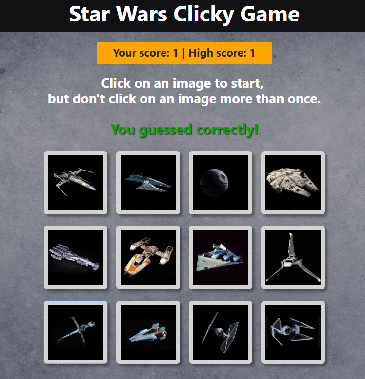
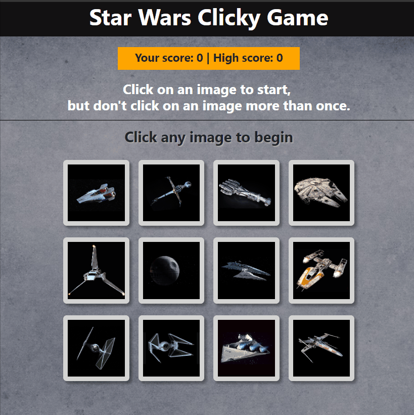

# Star Wars Clicky App

## [Deployed app](https://dirk-kiesewetter.github.io/react-clicky-game/)

## About the Star Wars Clicky App:

This app uses React to create a memory game. There are 12 game pieces. The goal of the game is to click on all 12 without clicking on any game piece twice. 

## Why this app?

Star Wars Clicky App was written to address the problem of how to create an interactive game that shuffles the game pieces in a random order, tracks user input, and stores the high score for that session. 

## Technical Solutions:

- React, JavaScript, and JSX were used both for the static elements (masthead and gameboard), as well as the dynamic game pieces, scoring, and game status (you guessed correctly/You guessed incorrectly).
- A json file contains the necessary data for each game piece.
- Card shuffling was done with a for loop to iterate through the game piece array, a nested if/else statement and random number logic to determine if the if or else is run. A different sorting method is run with the if portion of the statement than the else portion.
- The titlebar, gameboard, and game pieces are individual components.

## Demo

## Built With

- [Bootstrap](https://getbootstrap.com/)
- CSS3 
- HTML5 
- [JavaScript](https://developer.mozilla.org/en-US/docs/Web/JavaScript) 
- [React](https://reactjs.org/) 
- [Yarn](https://yarnpkg.com/en/) 

## Authors

- [Dirk Kiesewetter](https://github.com/dirk-kiesewetter)

